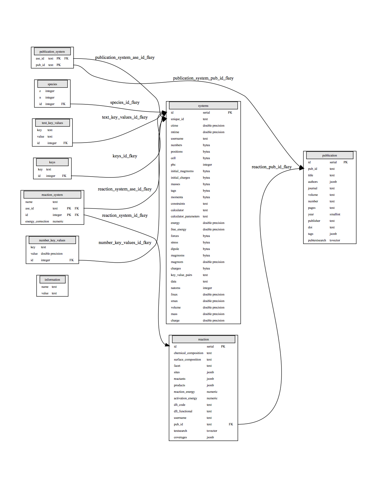

Topics
======

Below you can find documentation about the database structure and GraphQL.

Database schema
---------------

An overview of the database schema is given in the figure below.

The database structure builds upon the ASE-database (https://wiki.fysik.dtu.dk/ase/ase/db/db.html
) that uses the tables: `systems`, `species`, `keys`, `text_key_values`, `number_key_values`, `information`. These are used for storing atomic structures and calculational information.

On top is the tables `reaction` and `publication` which are used to store reaction energies and publication info for CatApp v2.0.

The tables `reaction_system` and `publication_system` links the ASE and CatApp parts together. 

GraphQL Queries
---------------

Go to the backend interface at http://api.catalysis-hub.org/graphql to start using our graphQL browser.

Type your query in the left panel. In order to perform queries on the `reactions` table start with::
  
   {reactions(first:2)}

And type `command + return` to see the result on the right hand. This should return the `id` of the first two reactions in the database. Notice that the left hand side is updated as well.

See the tutorials at http://catalysis-hub.readthedocs.io/en/latest/tutorials to learn more.

GraphQL Cheat Sheet
-------------------

Tables:

- reactions
  
- publications
  
- systems
  
- reactionSystems

Start your query with the table name followed by a query::

  {table(field:value)}

Query fields:

- Text fields:
  
  - field=value:    (field: "value")
    
  - field@>value:   (field: "~value")

  - distinct field: (field: "~", distinct: true)

- Integer / Float fields:
  
  - field=value:    (field: value)
    
  - field>value:    field:value, op: ”>”)

- Special fields:

  - first, last :     int

  - distinct:     true/false

  - before, after :   str id

  - order: sort by column:  (order: "field") or (order: "-field")

  - op:  ['=',  '>',  '<',  '>=', '<=', '!=']

    
- Output fields (systems table)

  - InputFile(format: ”vasp”)

- Special attributes:

  - totalCount: # entries

  - pageInfo: pagination

Incude the special attributes like this::
  
   {table(<field>:<value>){
     totalCount
     pageinfo
     edges{
       node{
         id
       }
     }
   }}

